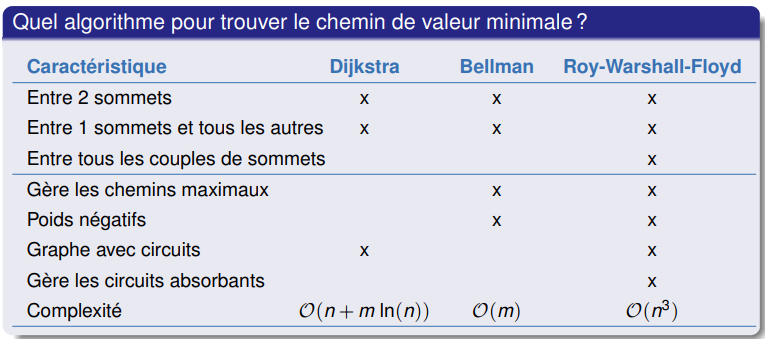

# Recherche Opérationnelle

## Optimisation dans les graphes

### Vocabulaire et définition

- graphes : orienté, simple, multigraphe, valué

- prédécesseur, successeur
- chemin, circuit
- racine, Degré intérieur (resp. extérieur) d’un sommet $x$

à compléter ...

### Algorithme de Kruskal

**Données :** $G = (V, E, p)$ : graphe non orienté valué

**Résultat :** Arbre couvrant de poids minimal de $G$

**Initial :** 

​		$k=0$ , $E_2=\empty$ 

​		$L=$ Liste des arêtes de $E$ triées par ordre de poids croissant

**pour** $k$ allant de $1$ à $n$ **faire :**

​		$w=$   $1^{ère}$ arête de $L$ ne formant pas de sous-cycle avec $E_2$

​		$E_2=E_2\cup\{w\}$

**retourner** $H = (V, E_2)$ 

**Complexité :** $\mathcal{O}(m\log m)$

**Algorithme de Kruskal est un algorithme glouton.**

### Cheminement

Théorème : Il existe un chemin de longueur minimale finie de $r$ à tous les sommets du graphe si et seulement si $r$ est une racine du graphe et le graphe ne contient pas de circuit absorbant  

#### Algorithme de Dijkstra

- Notation :
  - $pred(x)$ : Prédécesseur de x sur le meilleur chemin connu de $r$ à $x$
  - $\pi(x)$ : Longueur du meilleur chemin connu entre $r$ et $x$

**Données :** $G = (V, A, p)$ : graphe de poids positifs

**Résultat :** $H = (V, A_2)$ arborescence des plus courts  

**Initial :** 

​		$(V_2, pivot, \pi(r), A_2)=(r,r,0,\empty)$

**pour** tout $v\in V\backslash \{r\}$ **faire :**  

​		$\pi(v)=+\infty$

**pour** $j$ allant de $1$ à $n - 1$ **faire :**  

​		**pour** tout sommet $y\notin V_2$ tel que $y \in \Gamma^+(pivot)$  **faire :** 

​				**si** $\pi(pivot) + p(pivot, y) < \pi(y)$ **alors :**

​						$\pi(y)=\pi(pivot)+p(pivot,y)$

​						$pred(y)=pivot$

​		$pivot=\arg\min_{z\notin V_2}\pi(z)$

​		$V_2=V_2\cup\{pivot\}$

**pour** tout $x\in V\backslash \{r\}$ **faire :**  

​		$A_2=A_2\cup\{(pred(x),x)\}$

**retourner** $H(V, A_2)$

#### Algorithme de Bellman

- Algorithme - Tri topologique des sommets d’un graphe orienté : 
  - Le sommet de départ a pour valeur 0; les autres ne sont pas valués
  - À chaque itération : on value un sommet non valué dont tous les prédécesseurs sont valués 

**Données :** $G = (V, A, p)$ : graphe sans circuit 

**Résultat :** arborescence des plus courts  

**Initial :** 

​		$T=$ Sommets de $V$ ordonnés selon le tri topologique

​		$\pi(r)=0$

**pour** $j$ allant de $1$ à $n$ **faire :**

​		$\pi(T[i])=\min_{v\in\Gamma^-(T[i])}(\pi(v)+p(v,T[i]))$

  

#### Algorithme de Roy-Warshall-Floyd

**Données :** $G = (V, A, p)$ : graphe quelconque

**Résultat :** $M = m(x, y)$ : **valeur** d’un plus court chemin de $x$ à $y$  

**pour** $(x,y)\in A$ **faire :**  

​		$m(x,y)= (xy) \in A\ ?\ p(x,y)\ :+\infty$

​		$pred(x,y)=\empty$

**pour** tout $z\in V$ **faire :**  

​		**pour** tout $x\in V$ **faire :**  

​				**pour** tout $y\in V$ **faire :**  

​						**si** $m(x, y) > m(x, z) + m(z, y)$ **alors :** 

​								$m(x, y)=m(x, z) + m(z, y)$

​								$pred(x, y)=pred(z, y)$

​				**si** $m(x,x)<0$ **alors :**  

​						**STOP** (il y a un circuit absorbant)  

**Complexité :** $\mathcal{O}(n^3)$

#### Résumé

